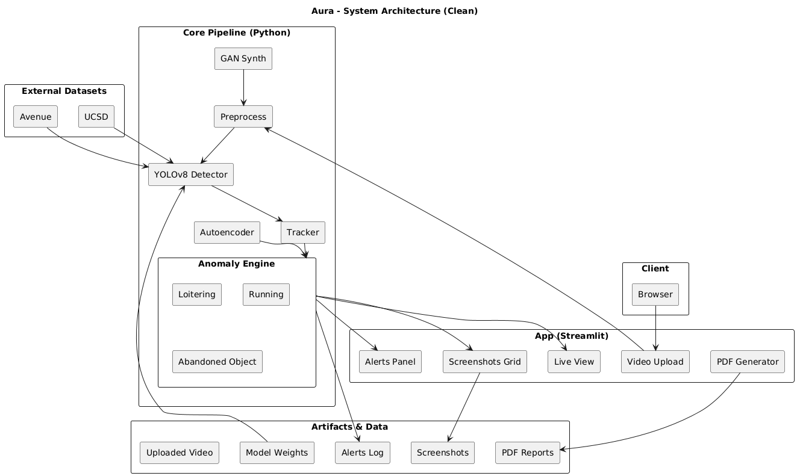

# Aura 🔍
AI-Powered Surveillance System for Real-Time Behavioral Anomaly Detection

## 🌟 Overview
**Aura** is an end-to-end video intelligence system that detects behavioral anomalies (Loitering, Running, Abandoned Object) from CCTV footage in real time. Built for the Honeywell Hackathon, Aura combines YOLOv8 detection, multi-object tracking, rule-based anomaly logic, and a clean Streamlit dashboard with alert logs, screenshots, and one-click PDF reporting. Experimental modules include Autoencoders (unsupervised anomaly detection) and GAN-based rare-event synthesis.

**Demo Video:** https://drive.google.com/file/d/1M-OuE4elwFSp2ZLw8SMpe3dDoyYRFovW/view?usp=sharing  

## 🚀 Features
- **Real-Time Detection & Tracking**: YOLOv8 + persistent IDs across frames  
- **Anomalies Detected**:
  - **Loitering**: stationarity beyond time & radius thresholds
  - **Running**: sudden high displacement between frames
  - **Abandoned Object**: owner–object link broken for ≥ threshold
- **Interactive Dashboard (Streamlit)**: live overlays (green = normal, red = anomaly), timestamped alert panel, screenshots grid
- **PDF Reporting (ReportLab)**: one-click export with alerts + evidence
- **Advanced (Optional)**: Autoencoder (unsupervised) and GAN synthesis for rare scenarios

## 🏗️ Tech Stack
| Component | Technology |
|---|---|
| Detection | Ultralytics YOLOv8 (nano by default) |
| CV / Utils | OpenCV, NumPy, Pillow |
| UI | Streamlit |
| Reporting | ReportLab (PDF) |
| Optional AI | Autoencoders (PyTorch), GANs (for rare event synthesis) |

## 📐 System Architecture


## ⚙️ Installation & Setup
1) Clone & env
```
git clone https://github.com/bhavika1304/Aura-Real-Time-AI-Anomaly-Detection-System.git
cd Aura-Real-Time-AI-Anomaly-Detection-System
python -m venv .venv && source .venv/bin/activate   # Windows: .venv\Scripts\activate
```

2) Install deps
```
pip install -r requirements.txt
# or minimal set:
pip install streamlit ultralytics opencv-python reportlab pillow numpy
```

3) Run the dashboard
```
streamlit run dashboard.py
Open the local URL → upload an .mp4/.avi → Start Processing.
```

4) CLI prototype 
```
# Set VIDEO_PATH inside main.py, then:
python main.py
```

## 🔧 Configuration (in code)

Resolution policy
```
TARGET_WIDTH = 800   # frames are resized to width 800 (keeps aspect)
```
Loitering
```
LOITER_TIME_THRESH = 5   # seconds
LOITER_DIST_THRESH = 20  # px radius at resized resolution
```
Running
```
RUNNING_SPEED_THRESH = 20  # px/frame instantaneous displacement
```
Abandonment
```
ABANDONMENT_TIME_THRESH = 5     # seconds
ABANDONMENT_DIST_THRESH = 100   # px from linked owner
```
Classes (COCO)
```
person (0), backpack (24), handbag (25), suitcase (26), briefcase (28)
```
Tips
• Thresholds are tuned for TARGET_WIDTH=800. If you change resolution, re-tune distances.
• If FPS is missing, default 30 FPS is assumed to convert seconds → frames.

## 🖥️ Dashboard

1. Video Upload: .mp4 / .avi
2. Live View: green boxes (normal), red boxes + label (anomaly)
3. Alerts Panel: timestamped anomalies (most recent first)
4. Screenshots Grid: 150×150 crops captured at the alert moment
5. Generate Report: one-click PDF with summary + embedded screenshots

## 🧠 How It Works 
- Preprocess → resize frames to width 800, read FPS (fallback 30)
- Detect → YOLOv8 finds people & carry-on objects per frame
- Track → stable IDs with position history across time
- Anomaly Engine:
  - Running → large instantaneous displacement
  - Loitering → positions within small radius for ≥ time window
  - Abandonment → object–owner link broken (distance/time thresholds)
- UI → draw overlays, log alerts, save cropped screenshots
- Report → compile timestamped PDF with evidence

## 📂 Folder Structure 
Aura-Real-Time-AI-Anomaly-Detection-System/
├─ dashboard.py           # Streamlit UI (upload, live view, alerts, screenshots, PDF)
├─ main.py                # CLI prototype for quick testing
├─ assets/
│  ├─ architecture.png    # optional: system diagram
│  └─ dashboard.png       # README screenshot
├─ data/                  # optional: sample videos
├─ requirements.txt
└─ README.md

## 🧪 Testing

- Functional: upload → detect → track → flag anomalies → verify alerts/screenshots
- Performance: YOLOv8n for CPU-friendly real time; YOLOv8s for higher accuracy (slower)
- Robustness: tune thresholds per camera/view; use Autoencoder for subtle anomalies
- Qualitative: validate on Avenue/UCSD style clips or your CCTV samples

## 📊 Results 

- Correctly flags Loitering, Running, Abandoned Object on sample surveillance clips
- Streamlit app provides live overlays, timestamped logs, evidence screenshots, PDF export
- Experimental:
  - Autoencoder improves coverage of subtle/unseen anomalies
  - GAN synthesis helps stress-test rare events
  - Full runs, clips, and logs: link your GitHub releases / demo folder

## ⚠️ Challenges & 💡 Learnings

- False positives from camera shake/occlusion → mitigated with tracking + temporal checks
- Data scarcity for rare events → augmented with GAN synthesis, tuned thresholds
- Real-time trade-offs on CPU → use YOLOv8n and 800w resize; consider GPU/ONNX/TensorRT for scale
- UX matters → alert logs + screenshots + PDF make the system practical beyond raw models

## 🔭 Future Scope

- Multi-camera ingestion & centralized monitoring
- Edge deployment (ONNX/TensorRT)
- Spatio-temporal deep models (ConvLSTMs / ViT-based)
- Additional behaviors: restricted-area entry, tailgating, crowd panic
- Human-in-the-loop feedback to accept/reject alerts and auto-tune thresholds

## 👩‍💻 Contributors
Bhavika Gandham (solo project for Honeywell Hackathon)
